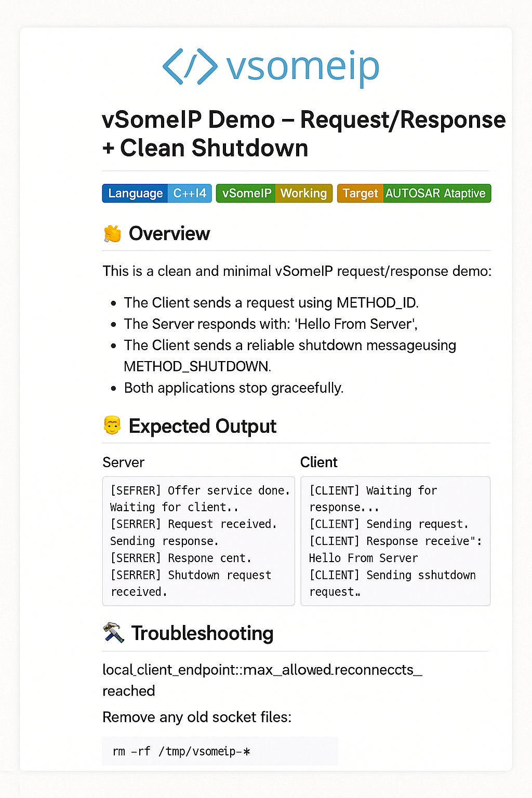

---

# 🚀 vSomeIP Demo — Request/Response + Clean Shutdown

<p align="center">
  
</p>
  <p align="center">
  
  
  
  
</p>

## 🔥 Overview

This project provides a clean **vSomeIP Request/Response demo** running on Linux. It demonstrates:

* A minimal **Server** offering a SOME/IP service.
* A minimal **Client** requesting the service.
* Clean and readable logs.
* A unified `vsomeip.json` configuration.
* A simple and organized CMake-based structure.

Both applications exchange:

* A normal request/response message.
* A **clean shutdown** request to stop both sides gracefully.

---

## 📂 Project Structure

```
vsomeip-demo/
├── CMakeLists.txt
├── README.md
├── config/
│   └── vsomeip.json
├── include/
│   ├── common.hpp
│   ├── client.hpp
│   ├── server.hpp
│   └── colors.hpp
└── src/
    ├── server.cpp
    └── client.cpp
```

---

## 🔧 Requirements

* Ubuntu 20.04+ (or any Linux distribution)
* CMake >= 3.10
* g++ >= 9
* vSomeIP installed:

```bash
sudo apt install libvsomeip3* -y
```

---

## 🧩 Build

```bash
mkdir build && cd build
cmake ..
make -j
```

---

## 🚀 Run

Open **two terminals**.

### 1️⃣ Start the Server

```bash
VSOMEIP_CONFIGURATION=../config/vsomeip.json ./server
```

### 2️⃣ Start the Client

```bash
VSOMEIP_CONFIGURATION=../config/vsomeip.json ./client
```

---

## 📝 Expected Output

### Server

```
[SERVER] Offer service done. Waiting for client...
[SERVER] Request received. Sending response...
[SERVER] Response sent.
[SERVER] Shutdown request received. Stopping...
```

### Client

```
[CLIENT] Waiting for response...
[CLIENT] Sending request...
[CLIENT] Response received: Hello From Server
[CLIENT] Sending shutdown request...
```

---

## 🔄 Communication Flow

```
+--------------------+         +------------------+
|     Client App     |         |    Server App    |
|--------------------|         |------------------|
| RequestService     |  -->    | OfferService     |
| Send(Method_ID)    |         | Handle Request   |
| Receive(Response)  | <--     | Send Response    |
| Send(Shutdown)     |  -->    | Stop Application |
+--------------------+         +------------------+
```

---

## 🛠️ Troubleshooting

### ❗ max_allowed_reconnects_reached

Remove old socket files:

```bash
rm -rf /tmp/vsomeip-*
```

### ❗ Config Mismatch

Ensure both Server and Client use:

* The same `vsomeip.json`
* The same service ID & instance ID
* The same reliable/unreliable ports
* Matching application names

---
## 📝  Output Result

<p align="center">
  
</p>